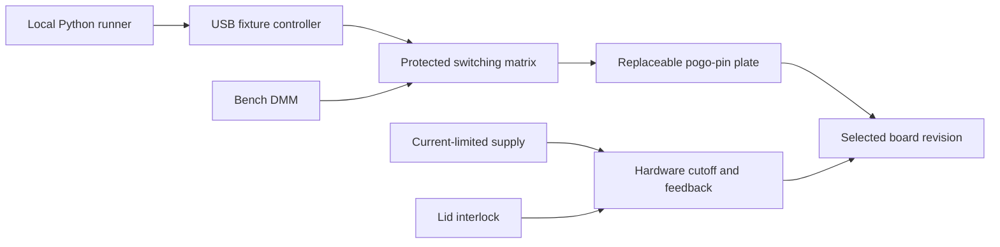

# Fixture hardware plan

Status: conceptual architecture and requirements. The software does not operate hardware. No fabrication-ready electronics, verified pin map, or MCU firmware is included.

## Proposed bench prototype

- One selected real PCB model and revision, with 16 accessible test points.
- A removable pogo-pin adapter, alignment stops, board supports, and contact-verification method.
- RP2040-class USB controller for switching/control, separate instrument interfaces, and hardware state feedback.
- Current-limited bench supply and DMM for the first physical prototype.
- A switching matrix appropriate to actual voltage/current/leakage requirements; power paths separated from measurement paths.
- Independent lid/interlock cutoff and output-disabled startup/watchdog behavior.

The [RP2040 datasheet](https://datasheets.raspberrypi.com/rp2040/rp2040-datasheet.pdf) is a controller reference. Circuit design must include appropriate level translation, drivers, protection, and power domains; PCB test nodes and relay coils do not connect directly to arbitrary MCU GPIO pins.

## Electrical requirements

Before resistance measurements, remove all power/stimuli, measure residual/external voltage, and verify discharge below a defined board-specific threshold. A successful software off command alone is insufficient. Verify that the chosen meter's resistance excitation cannot damage or inadvertently power the board.

Use break-before-make routing and document settling/discharge times. Include a hardware current limit, board-appropriate fuse/protection, interlock cutoff, and measured terminal-voltage feedback. Hardware must remove power independently of host cleanup when the lid opens, the watchdog expires, or controller communication fails.

Start with supply current before rail/function tests. Functional input drivers must have suitable logic levels, series protection, disabled-state behavior, and a defined test firmware/operating state. UART echo needs a documented diagnostic firmware protocol; shorting arbitrary TX/RX pins is not a general board diagnostic.

Four-wire measurements or characterized lead/contact compensation may be required for low-resistance checks. In-circuit values depend on parallel paths and junctions; use board-specific signatures. A failed net check narrows the investigation and does not automatically identify a component.

## Mechanical concept

`demo-plate.scad` is an editable OpenSCAD concept for the synthetic point grid. Its configurable hole and mounting dimensions are placeholders. It has not been rendered, manufactured, or fitted to a real board. Validate PCB view/orientation, pin/receiver dimensions, stroke, force, pad geometry, support locations, and tolerances before fabricating an adapter.

The file places the recipe's 16 demo coordinates inside a surrounding plate margin. It does not establish a real PCB outline, electrical connector mapping, or production fixture design.

## Tentative BOM categories

| Item | Selection criteria |
| --- | --- |
| USB controller board | Timer/watchdog, required I/O, documented logic levels |
| Pogo pins and receivers | Pad access, stroke, force, tip geometry, rated cycles/current |
| Plate and supports | Repeatable registration without PCB flexure |
| Signal relays/switches | Leakage, contact resistance, voltage range, topology |
| Power cutoff | Independent interlock, current rating, default-off behavior |
| Bench supply and DMM | Current limiting, measured feedback, accuracy/uncertainty, controllable interface |
| Protection and wiring | Board envelope, strain relief, safe switching and discharge |

No purchasing list or prices are finalized before choosing and measuring the real board.
